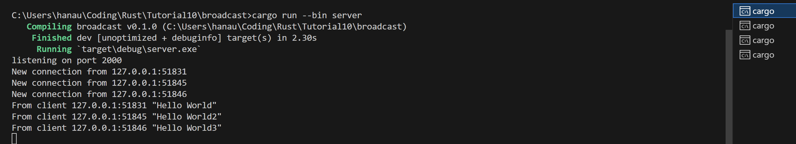
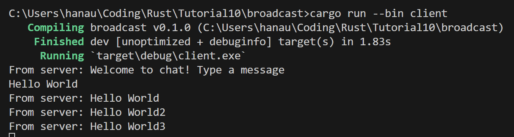
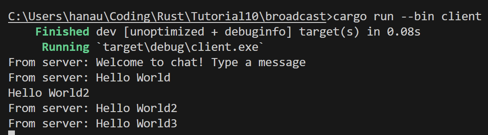
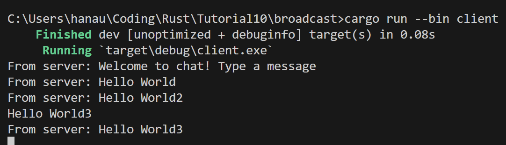
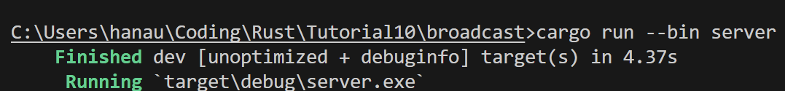
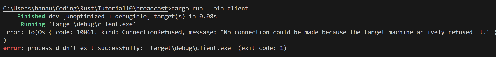
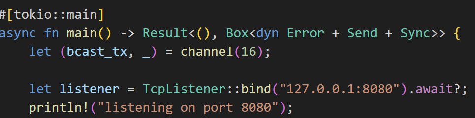
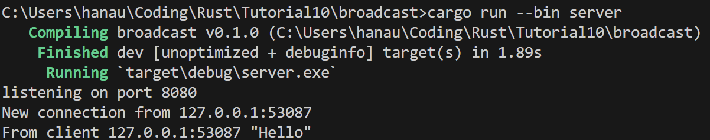
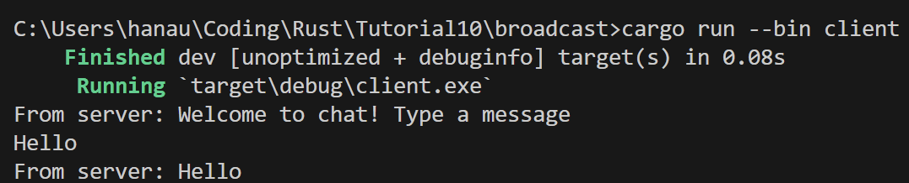

## 2.1. Original code of broadcast chat.

Bagaimana cara menjalankan?   
    Untuk menjalankannya, saya membuka 4 Terminal Vscode dan menjalankan "cargo run --bin server" pada 1 Terminal dan "cargo run --bin client" pada 3 Terminal lainnya. Perintah "cargo run --bin server" untuk menjalankan server dan perintah "cargo run --bin client" untuk menjalankan client.
 
Apa yang terjadi ketika mengetikkan teks pada beberapa client?  
    Ketika saya mengetikkan teks atau mengirimkan message dari salah satu client, maka server akan menerima message tersebut, lalu mengirimkan message tersebut ke ketiga client termasuk client yang mengirimkan message tersebut.

## Modifying the websocket port

Ketika mengubah port pada client menjadi 8080, maka akan terjadi error karena client tidak dapat terkoneksi dengan port tersebut. Hal ini karena server melakukan bind dengan port 2000 bukan port 8080. Untuk itu, saya harus merubah code pada server untuk melakukan bind pada port 8080 sehingga client dapat terconnect dengan server.

